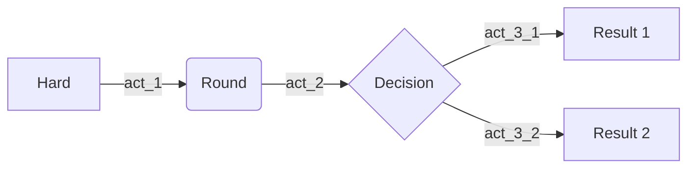

## Image

{: width="700" height="400" .normal .shadow}
_Bonjour, Elliot._


## Video


## Prompts
> Example line for prompt.
{: .prompt-info }


## Syntax

### inline code
`this is inline code`

### code lang
```cpp
int main(){
    std::vector<cv2::KeyPoint> keypoints;
    return 0;
}
```
{: file="assets/files/post-0/test.cpp"}


### filepath highlight
`assets/img/post-0/5.jpg`{: .filepath}


## Math

block math:

$$
scale_i = \frac{d_{true_i}}{d_{est_i}}
$$

block math, numbered:

$$
\begin{equation}
  \sum_{n=1}^\infty 1/n^2 = \frac{\pi^2}{6}
  \label{eq:series}
\end{equation}
$$

We can reference the equation as \eqref{eq:series}.

inline math: $$ CP^2 + t_z^2 - 2 CP t_z \cos(\pi/2 - \phi_c) = 0$$

inline math in lists:

1. \$$ 1+1=2 $$
2. \$$ 2+2=4 $$
3. \$$ 3+3=6 $$


## Diagrams with Mermaid




Sometimes we need to migrate resources that are managed in Terraform. Terraform is a declarative language to manage cloud infrastructure from code, which allows you to reliably automate your deployments and put your infrastructure configuration under version control. We call this Infrastructure as Code (IaC).

When moving resources in your IaC, Terraform will by default delete the resource and re-create it at the new path. In the best case this is relatively harmless, depending on whether some downtime is acceptable, but nevertheless wasted effort because we already know the recreated resource will be identical to the removed resource. Worst case, we absolutely do not want to delete and recreate the resource, for example because it holds data (think: storage accounts, databases). Another reason you do not want to recreate resources is if they use on system-assigned identities for connecting to other resources (role-based access that is tied to the lifecycle of the resource itself). In that case, recreating the resource will likely break functionality.

So how do we properly migrate cloud resources managed by Terraform? Properly means that Terraform will update its pointer to the remote resource and that the remote resource itself remains unaffected. There are various scenarios in which you need to migrate Terraform resources:

A. Moving resource blocks within the same Terraform state, for example to a child module.
B. Moving a resource block to another module altogether, for example because over time you have developed dependency cycles and refactoring is overdue.
C. Removing a resource from Terraform management altogether without deleting the resource.
D. Bring an existing resource under Terraform management without Terraform trying to create a resource that already exists
Scenario A and B are the most interesting scenarios. In particular scenario B is a superset of scenarios C and D, so they are discussed in one go.

Sometimes we need to migrate resources that are managed in Terraform. Terraform is a declarative language to manage cloud infrastructure from code, which allows you to reliably automate your deployments and put your infrastructure configuration under version control. We call this Infrastructure as Code (IaC).


<script src="https://cdn.jsdelivr.net/npm/mermaid@10.9.1/dist/mermaid.min.js"></script>

<script>
    mermaid.initialize({
        theme: 'neutral'
    });
</script>