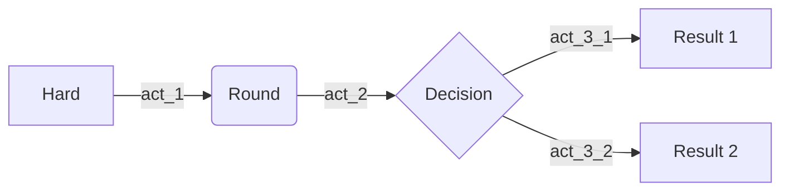

## Image

{: width="700" height="400" .normal .light .shadow}
_Bonjour, Elliot._


## Video


## Prompts
> Example line for prompt.
{: .prompt-info }


## Syntax

### inline code
`this is inline code`

### code lang
```cpp
int main(){
    std::vector<cv2::KeyPoint> keypoints;
    return 0;
}
```
{: file="assets/files/post-0/test.cpp"}


### filepath highlight

`assets/img/post-0/5.jpg`{: .filepath}


## Math

block math:

$$
scale_i = \frac{d_{true_i}}{d_{est_i}}
$$

block math, numbered:

$$
\begin{equation}
  \sum_{n=1}^\infty 1/n^2 = \frac{\pi^2}{6}
  \label{eq:series}
\end{equation}
$$

We can reference the equation as \eqref{eq:series}.

inline math: $$ CP^2 + t_z^2 - 2 CP t_z \cos(\pi/2 - \phi_c) = 0$$

inline math in lists:

1. \$$ 1+1=2 $$
2. \$$ 2+2=4 $$
3. \$$ 3+3=6 $$


## Diagrams with Mermaid




<script src="https://cdn.jsdelivr.net/npm/mermaid@10.9.1/dist/mermaid.min.js"></script>

<script>
    mermaid.initialize({
        theme: 'neutral'
    });
</script>